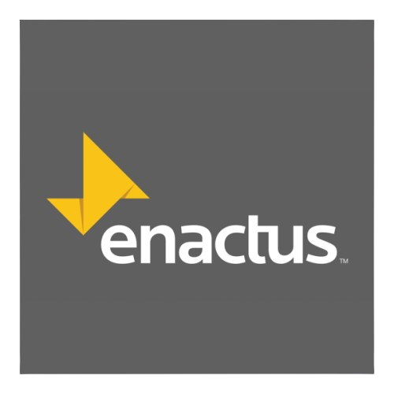
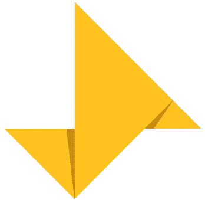

  

<h1 align="center"> Enactus Integrated Platform</h1>

  &nbsp;&nbsp;
  &nbsp;&nbsp;
  &nbsp;&nbsp;
  &nbsp;&nbsp;
  &nbsp;&nbsp;
  

  <a href="#-features"><b>✨ Features</b></a> •
  <a href="#-tech-stack"><b>🧱 Tech Stack</b></a> •
  <a href="#-getting-started"><b>🚀 Getting Started</b></a> •
  <a href="#-authentication--roles"><b>🔐 Auth & Roles</b></a> •
  <a href="#-contributing"><b>🤝 Contributing</b></a> •
  <a href="#-license"><b>📄 License</b></a>

---

## 📖 About

The **Enactus Integrated Platform** is the central digital hub for Enactus South Africa. It brings together students, ventures, programme managers, and partners on one platform — enabling seamless collaboration, impact tracking, and real-time reporting across all university teams.

Designed with respect for South Africa's diverse population and POPIA compliance, the platform collects demographic data only for aggregated, anonymised reporting, with every field voluntary and a "prefer not to say" option.

---

## ✨ Features

<table>
  <tr>
    <td width="50%">
      <h4>👥 Student CRM</h4>
      
Comprehensive profiles, demographics, and engagement tracking with respect for privacy.

    </td>
    <td width="50%">
      <h4>🚀 Venture Tracking</h4>
      
Projects from startup to scale-up, with stage updates, sectors, and multi‑year team histories.

    </td>
  </tr>
  <tr>
    <td>
      <h4>📅 Programme Management</h4>
      
Create training, competitions, bootcamps and record attendance per student.

    </td>
    <td>
      <h4>📝 Dynamic Form Submissions</h4>
      
Custom forms per programme with JSON storage – text, numbers, selects, file uploads.

    </td>
  </tr>
  <tr>
    <td>
      <h4>📊 Monitoring & Evaluation</h4>
      
Period‑based metrics: revenue, jobs created, beneficiaries, funding raised, CAC.

    </td>
    <td>
      <h4>🏆 Leaderboard</h4>
      
Score projects in startup/scale‑up stages and rank them per reporting cycle.

    </td>
  </tr>
  <tr>
    <td>
      <h4>📚 LMS</h4>
      
Learning modules with progress tracking per student.

    </td>
    <td>
      <h4>🔐 Role‑Based Access</h4>
      
8 user roles – student, faculty advisor, programme manager, business advisor, alumni, judge, board member, admin.

    </td>
  </tr>
</table>

---

## 🧱 Tech Stack

## 🧱 Tech Stack

<table>
  <tr>
    <td width="50%">
      <h4>🔧 Backend</h4>
      

         Laravel 11 
         PHP 8.4
      

    </td>
    <td width="50%">
      <h4>🗄️ Database</h4>
      

         PostgreSQL 15 (Supabase) 
         Row‑Level Security ready
      

    </td>
  </tr>
  <tr>
    <td>
      <h4>🚀 Deployment</h4>
      

         Coolify 
         Hetzner CX23 
         Cloudflare (Full SSL)
      

    </td>
    <td>
      <h4>🔐 Authentication</h4>
      
Session‑based auth with 8 custom roles and middleware protection.

    </td>
  </tr>
  <tr>
    <td>
      <h4>🎨 Frontend</h4>
      
Blade templates with Tailwind CSS (planned).

    </td>
    <td>
      <h4>🧪 Testing</h4>
      
PHPUnit for unit and feature tests.

    </td>
  </tr>
  <tr>
    <td>
      <h4>⚡ Cache & Queue</h4>
      
Database driver for development; Redis ready for production.

    </td>
    <td>
      <h4>📦 Package Management</h4>
      
Composer for PHP dependencies.

    </td>
  </tr>
</table>

> ⚠️ **For the icons to show on GitHub**, replace `public/images/...` paths with the raw GitHub URLs of your images. For example:  
> `https://raw.githubusercontent.com/Nkosi2000/Enactus-Integrated-Platform/main/public/images/laravel.svg`

---

### 